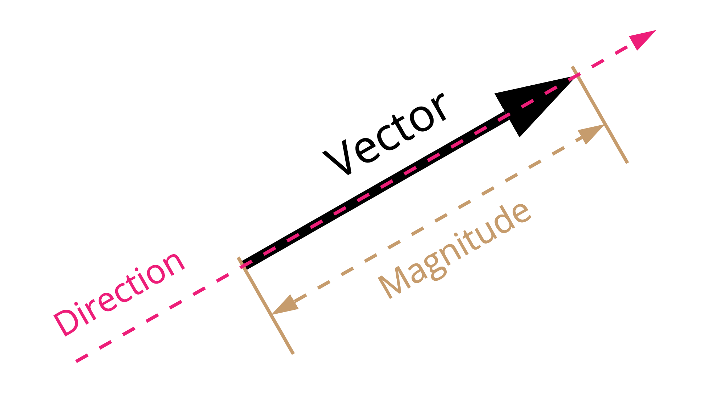

```fm
style: negative
background: true
```

## Hello _👋_

# {{process.content.frontmatter.title}}

Workshop · Liip Lab

<footer>

2023 · Zurich · Stefan Huber

</footer>

--s--

```fm
style: image
background:
  image: https://portrait.signalwerk.ch/illustration/2020/rgb/w4000/stefan-huber.jpg
  position: 50% 40%
```

## Stefan

<div class="box box--w40p box--bottom box--white box--padding small">

- Developer
- ❦ Typography

</div>

<footer class="footer--right">

Illustration by [Benjamin Güdel](http://www.guedel.biz/) · 2020

</footer>

--s--

## Objective of the session

- Understand the basics of embeddings
- Get embeddings for text & shape text
- Target 1.5h so we have time for questions/inputs

> I try to give you inputs, not solutions

--s--

## Non-Objective of the session

> This ssession is not about theory, <br>it's about how to use stuff

--s--

```fm
style: negative
background: true
```

## Embeddings

# _Vectors_ with **AI**

--s--

## What is a vector?

- magnitude (length)
- direction (angle)
- in given space (dimensions)

--s--

## Vector Example in 2D



--s--

```fm
style: negative
background: true
```

## Example

# Vectors for Words

--s--

## Stupid one dimensional vector-search

<div style="font-size: .6em">

| Data         | Fake Vector |
| ------------ | ----------- |
| `Banana`     | `1`         |
| `Bonobo`     | `2`         |
| `Chimpanzee` | `3`         |
| `Gorilla`    | `4`         |
| `Monkey`     | `5`         |
| `Watermelon` | `6`         |

</div>

--s--

## Stupid one dimensional vector-search

<div style="font-size: .6em">

| Data         | Fake Vector |
| ------------ | ----------- |
| `Banana`     | `1`         |
| `Bonobo`     | `2`         |
| `Chimpanzee` | `3`         |
| `Gorilla`    | `4`         |
| `Monkey`     | `5`         |
| `Watermelon` | `6`         |

### Search: `Monkey` → get `5` as (embedding) result

| _Data_   | _Found Vector_ |
| -------- | -------------- |
| `Monkey` | `5`            |

</div>
--s--

## Stupid one dimensional vector-search

<div style="font-size: .6em">

| Data         | Fake Vector |
| ------------ | ----------- |
| `Banana`     | `1`         |
| `Bonobo`     | `2`         |
| `Chimpanzee` | `3`         |
| `Gorilla`    | `4`         |
| `Monkey`     | `5`         |
| `Watermelon` | `6`         |

### Search: `Monkey` → get `5` as (embedding) result

| _Data_       | _Found Vector_  |
| ------------ | --------------- |
| `Monkey`     | `5`             |
| `Gorilla`    | `4` (`Delta 1`) |
| `Watermelon` | `6` (`Delta 1`) |

</div>
--s--

## Stupid one dimensional vector-search

<div style="font-size: .6em">

| Data         | Fake Vector |
| ------------ | ----------- |
| `Banana`     | `1`         |
| `Bonobo`     | `2`         |
| `Chimpanzee` | `3`         |
| `Gorilla`    | `4`         |
| `Monkey`     | `5`         |
| `Watermelon` | `6`         |

### Search: `Ape` → get `7` as (embedding) result

| _Data_       | _Found Vector_  |
| ------------ | --------------- |
| `Watermelon` | `6` (`Delta 1`) |
| `Monkey`     | `5` (`Delta 2`) |
| `Gorilla`    | `4` (`Delta 3`) |

</div>

--s--

## Inteligent vector-search (1 Dimension)

<div style="font-size: .6em">

| Data         | Fake Vector |
| ------------ | ----------- |
| `Monkey`     | `201`       |
| `Bonobo`     | `202`       |
| `Chimpanzee` | `203`       |
| `Gorilla`    | `204`       |
| `Banana`     | `501`       |
| `Watermelon` | `502`       |

### Search: `Ape` → get `200` as (embedding) result

| _Data_       | _Found Vector_    |
| ------------ | ----------------- |
| `Monkey`     | `201` (`Delta 1`) |
| `Bonobo`     | `202` (`Delta 2`) |
| `Chimpanzee` | `203` (`Delta 3`) |

</div>

--s--

```fm
style: negative
background: true
```

## Sentence/Word Embeddings

# AI-Powered Search

- Representation of _Sentence/Word in a Vector_
- **1536 Dimensions** for OpenAIs current model
- Not specific to _language_

--s--

## Embeddings search

> steueramt im kanton basel-stadt öffnungszeiten <br>
> (tax office in the canton of basel-city opening hours)

- [Google](https://www.google.com/search?q=steueramt+im+kanton+basel-stadt+%C3%B6ffnungszeiten)
- [bs.ch](https://www.bs.ch/?navopen=search&search=steueramt+im+kanton+basel-stadt+%C3%B6ffnungszeiten)
- [Proof of Concept](https://basel.search.srv.signalwerk.ch/?q=steueramt%20im%20kanton%20basel-stadt%20%C3%B6ffnungszeiten) with OpenAI
- _Find_ with vector the _rigth document_
- _Answer_ with `ChatGPT` the _Queston_ and _give a Link_ to the document

--s--

## Inteligent vector-search

<div style="font-size: .6em">

| Data         | Vector  |
| ------------ | ------- |
| `Monkey`     | `[ … ]` |
| `Bonobo`     | `[ … ]` |
| `Chimpanzee` | `[ … ]` |
| `Gorilla`    | `[ … ]` |
| `Banana`     | `[ … ]` |
| `Watermelon` | `[ … ]` |

### Search: `Ape` → get `[ … ]` as (embedding) result

| _Data_       | _Found Vector_ |
| ------------ | -------------- |
| `Monkey`     | `[ … ]`        |
| `Bonobo`     | `[ … ]`        |
| `Chimpanzee` | `[ … ]`        |

</div>

--s--

## Embeddings

- Search _by similarity_
- Search like google/youtube/…
- Combine search with Keywords & Vectors

--s--

## Embeddings

## Examples

- index _content_ with vectors (websites, pdf, img, ...)
- _classify_ comments in shop (compare to `good`/`bad` vectors)
- FAQ/search/assistant

--s--

## Get a Vector

- [OpenAI API](https://platform.openai.com/docs/guides/embeddings) · $0.0004 / 1K tokens
- Open Alternatives · [SBERT Sentence-Transformers](https://www.sbert.net/docs/pretrained_models.html#multi-lingual-models)

--s--

## OpenAI API Keys and Management

- API-Access needs an _API-Key_ → contact `#ai-exchange`
- The [API-Key](https://platform.openai.com/account/api-keys) is bound to _your OpenAI User_
- _Name_ your API-Keys
- Be aware of your _organization's_

--s--

## Tokens

- Tokens are the _smallest unit_ of input
- Tokens are _not words_ but a set of **vocabulary**
- Each model has a _different tokens_ and _size limits_

<br>

### Example

`text-embedding-ada-002` can process _4096 tokens_. If you have more than 4096 tokens, you need to split your request into multiple requests or use an other model.

<footer>

Test: [OpenAI · Tokenizer](https://platform.openai.com/tokenizer)

</footer>

--s--

## API-Requests

You send a request to a specific model.

<div style="font-size: 0.8em">

```js
fetch("https://api.openai.com/v1/embeddings", {
  method: "POST",
  headers: {
    "Content-Type": "application/json",
    Authorization: `Bearer ${OPENAI_API_KEY}`,
    "OpenAI-Organization:": `${OPENAI_API_ORG}`,
  },
  body: JSON.stringify({
    /* data */
  }),
});
```

</div>

<footer>

[Open AI · Documentation](https://platform.openai.com/docs/guides/embeddings/)

</footer>

--s--

```fm
style: negative
background: true
```

## Live coding

# Let's get some embeddings

- [see Workbench](https://ai-text.signalwerk.ch/)
- [Documentation](https://platform.openai.com/docs/guides/embeddings/)

--s--

## Get Sentence-/Word Embeddings

<div style="font-size: .6em">

```json
{
  "object": "list",
  "data": [
    {
      "object": "embedding",
      "index": 0,
      "embedding": [
        -0.000978393,
        // …
        // 1536 dimensional vector for the word "Bear"
        // …
        -0.01352617
      ]
    }
  ],
  "model": "text-embedding-ada-002-v2",
  "usage": {
    "prompt_tokens": 1,
    "total_tokens": 1
  }
}
```

</div>

--s--

## Similarity Search

# Which distance function should I use?

- [Cosine similarity](https://platform.openai.com/docs/guides/embeddings/which-distance-function-should-i-use)

--s--

## Similarity Search

<div style="font-size: 0.6em">

```js
function cosineSimilarity(vecA, vecB) {
  if (vecA.length !== vecB.length) {
    throw new Error("Vectors must have the same length.");
  }

  let dot = 0;
  let magA = 0;
  let magB = 0;

  for (let i = 0; i < vecA.length; i++) {
    dot += vecA[i] * vecB[i];
    magA += vecA[i] * vecA[i];
    magB += vecB[i] * vecB[i];
  }

  return dot / (Math.sqrt(magA) * Math.sqrt(magB));
}
```

</div>

--s--

## Find via Vector

How to get that quick?

- [typesense](https://typesense.org/)
- [Pinecone](https://www.pinecone.io/)
- [pgvector – PostgreSQL](https://github.com/pgvector/pgvector)
- …

--s--

```fm
style: negative
background: true
```

## exit 0; thx

# Questions?

--s--

```fm
style: negative
background: true
```

## Reminder

# _Liip Lab_ · AI

- **[liip.to/ailab](https://liip.to/ailab)**
- **Google-Calendar «Events intern»**
